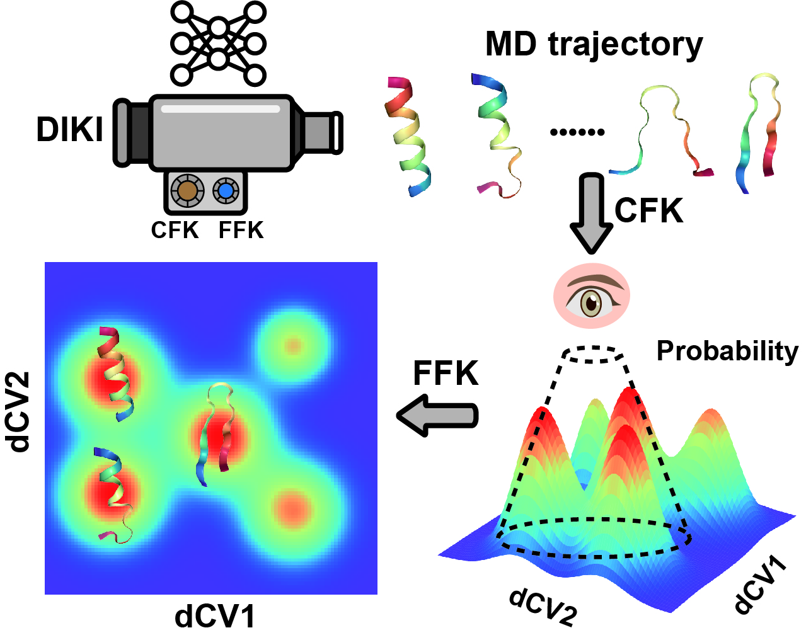

# DIKI
Deep Identification of Key Intermediates

DIKI is a VAE-based neural network for analyzing conformations in Molecular Dynamics trajectories.
The work has been accpeted by Journal of Chemical Theory and Computation (JCTC). Please cite our 
paper if you use DIKI in your work:  
  
&ensp;&ensp; X. Liu, J. Xing, W. Cai, X. Shao. Analyzing Molecular Dynamics Trajectories Thermodynamically through Artificial Intelligence. Journal of Chemical Theory and Computation, 2024, xxx: xxx-xxx.  

We provide the following codes for use:  
&ensp;&ensp; 1. align a dcd trajectory to a reference structure and output a npz file of aligned Cartesian coordinates.  
&ensp;&ensp; 2. build a VAE model  
&ensp;&ensp; 3. use HDBSCAN iteratively updating the latent space  
&ensp;&ensp; 4. plot the similarity heatmap used in our paper  

## Virtual Environment  
The required packages and their versions are included in requirement.txt file. Run the following commands to build your environment:  
```bash
conda create -n DIKI python=3.8.11  
conda activate DIKI  
pip install -r requirement.txt
```

## Use of DIKI
